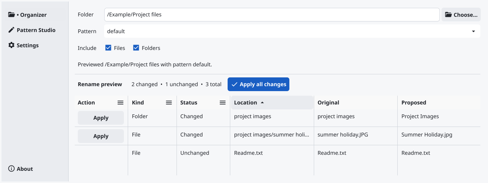
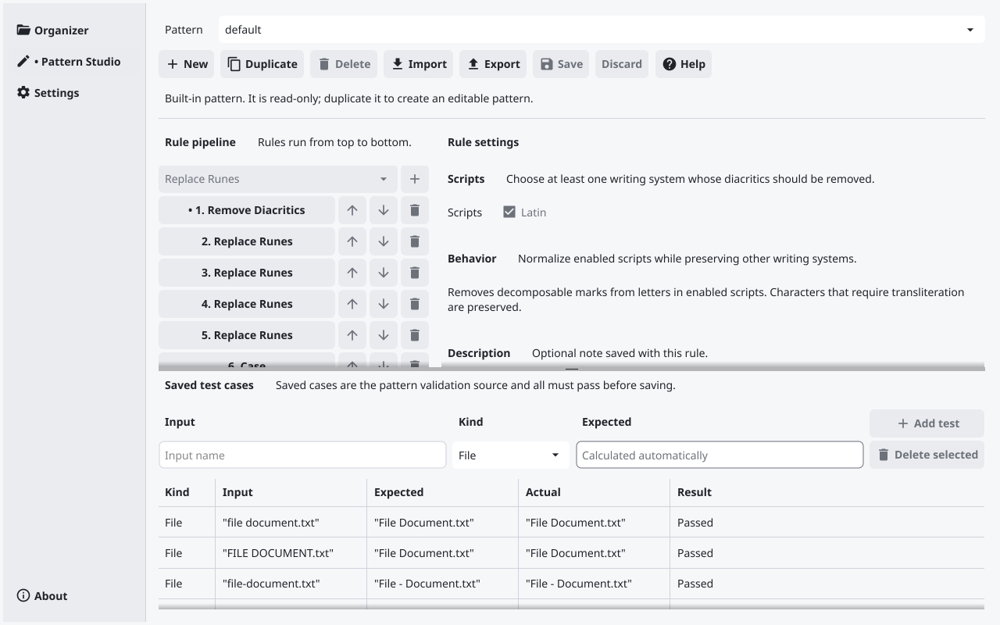

# File & Folder Renamer

Preview proposed file and folder names across a folder tree before applying changes. File & Folder Renamer lets you review each rename, catch conflicts, and create reusable naming rules with saved examples.

It is a desktop application for macOS, Windows, and Linux. Launching it opens the graphical interface; there is no command-line mode. The running version appears in **About**.

## Download

Get published builds from [GitHub Releases](https://github.com/EightAugusto/file-folder-renamer/releases). If that page has no release yet, binaries have not been published; use the [development guide](docs/development.md) to run the app from source.

| Platform | Release file | How to start |
| --- | --- | --- |
| macOS 12 or newer, Apple Silicon | `File & Folder Renamer_<version>_darwin_arm64.dmg` | Open the DMG and drag the app to Applications. |
| macOS 12 or newer, Intel | `File & Folder Renamer_<version>_darwin_amd64.dmg` | Open the DMG and drag the app to Applications. |
| Windows x64 | `file-folder-renamer_<version>_windows_amd64.exe` | Run the executable; there is no installer. |
| Linux x64 | `file-folder-renamer_<version>_linux_amd64` | Make the downloaded file executable, then run it. |

The Linux binary targets glibc 2.36 and needs the system's OpenGL, X11, Wayland, and xkbcommon runtime libraries. Current macOS builds are unsigned and unnotarized, so macOS may block their first launch. See [Apple's guidance for opening an unnotarized app](https://support.apple.com/en-gb/102445) and open software only when you trust its source.

## Quick start

1. Launch the app and open **Organizer**.
2. Select **Choose** and pick a folder. The app scans its files and subfolders and shows a rename preview.
3. Choose a saved pattern and whether to include files, folders, or both. Review the original and proposed names, and resolve any reported conflicts.
4. Select **Apply all changes** and confirm, or select **Apply** on one changed row. The app checks the preview again before it starts renaming.

For example, a preview might show `project images` → `Project Images` and `summer holiday.JPG` → `Summer Holiday.jpg`. The screenshot uses synthetic example files; your preview depends on the pattern you select.

## What it does

- **Review an entire folder tree:** See proposed and unchanged names, counts, and per-row actions before making changes.
- **Catch conflicts:** The app checks collisions, occupied targets, and changes to the scanned names since the preview was created. It asks for confirmation before applying.
- **Handle connected renames:** Batch apply stages chains, swaps, case-only changes, and nested folders in a safe order.
- **Customize patterns:** Combine case, character replacement, and diacritic rules. Use saved file and folder examples to check a pattern before saving it.
- **Fit your workspace:** Choose English (United States) or Spanish (Mexico), use light or dark theme, and configure which names to ignore.

## Pattern Studio

The built-in patterns are read-only. Duplicate one or create a new pattern, arrange its rules, and save test cases with expected names. Every saved test case must pass before a custom pattern can be saved. Patterns can also be imported and exported as JSON.

## Before applying changes

Changing the selected folder, file types, or pattern invalidates the preview. Before applying, the app rescans the selected tree and rejects a preview if its proposed renames changed. It does not check file contents. Once a rename batch begins, it cannot be canceled. If an operation fails, rollback is best effort; a process crash or rollback failure can leave some names changed. Keep a backup of important folders.

## More information

- [User guide](docs/user-guide.md): Organizer, Pattern Studio, settings, language, and JSON configuration.
- [Development guide](docs/development.md): run tests, start the app from source, inspect the UI, and add translations.
- [Release build guide](docs/release-builds.md): build commands, platform toolchains, artifact names, and verification limits.

For bugs or questions, [open a GitHub issue](https://github.com/EightAugusto/file-folder-renamer/issues). File & Folder Renamer is licensed under the [Apache License 2.0](LICENSE).
